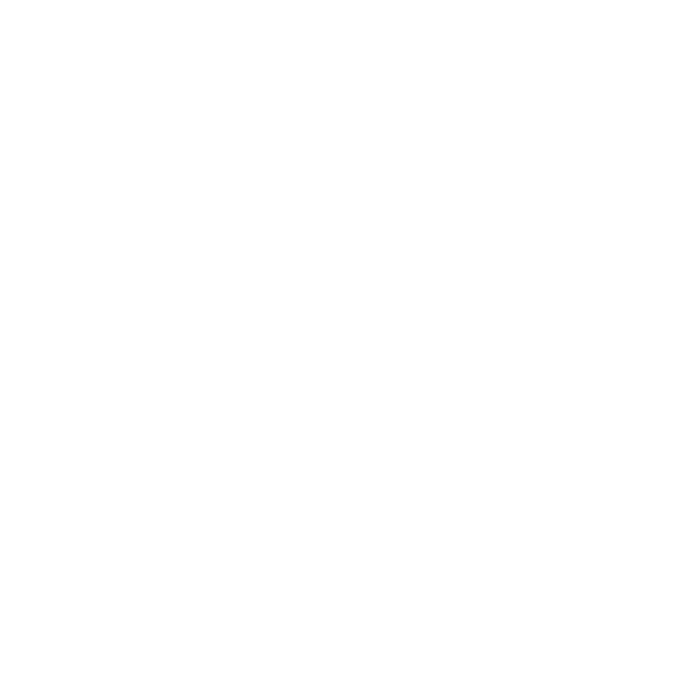

logo
===

## Usage
Our logo is used to represent the entire app or project.

Always ensure that the background you are using has only one color or a harmoning gradient.

{width=400px}

If it is not possible to ensure this, please use the flat logo.

{width=400px}

## Dimensions
There is no limit on how big the logo can or should be.

To make sure it is readable do not go under the size where the leaves are no longer visible. Exceptions for this are fav icons etc. where there are technical constraints.

Always make sure to keep the square aspect ratio for the logo!

## Positioning
The logo is placed completely centered. 

Always keep the _protective area_ to make sure the logo can _breathe_.
